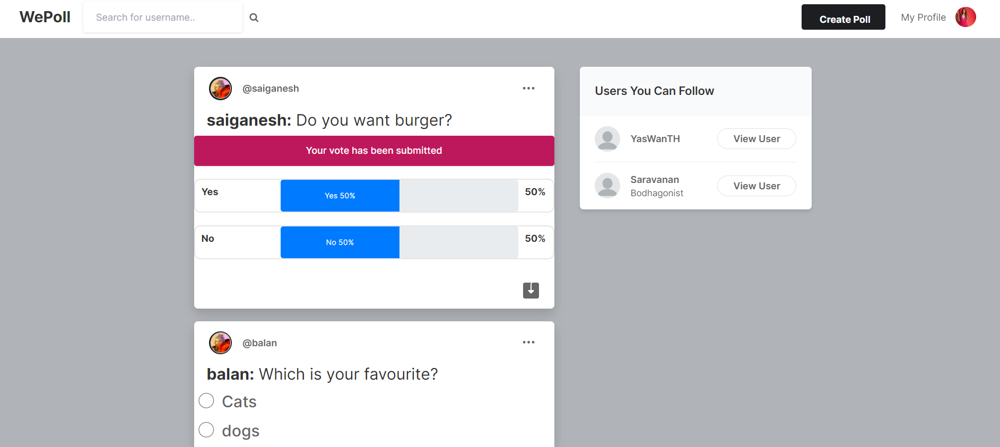
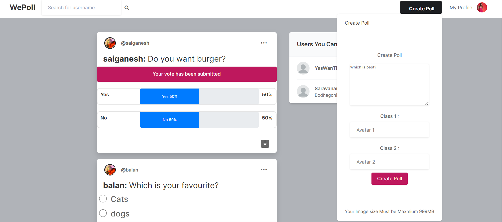
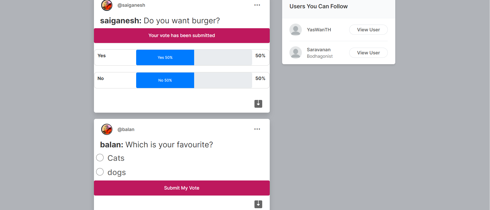

# WePoll | Social Network App

I tried in this project to build an application similar to instagram where in people can follow each other and post polls for any two categories and get responses from the other users.

## Live Demo
[https://vinubalanj.pythonanywhere.com/signin?next=/logout)

## Project Screenshot

## Project Features:
- Nice design as Instagram/Facebook design.
- Ability to post polls
- search feature to search users
- follow users feature
